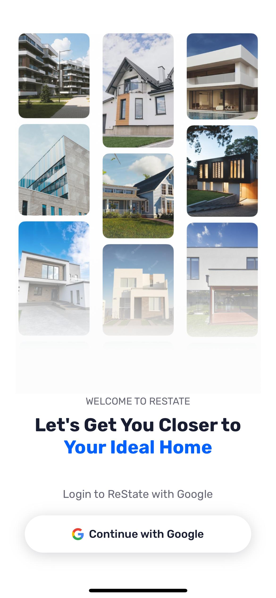
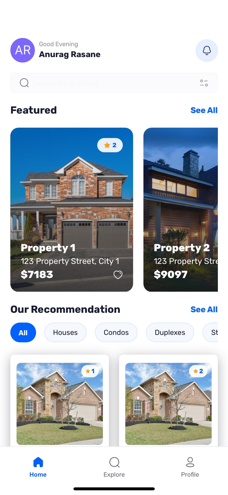
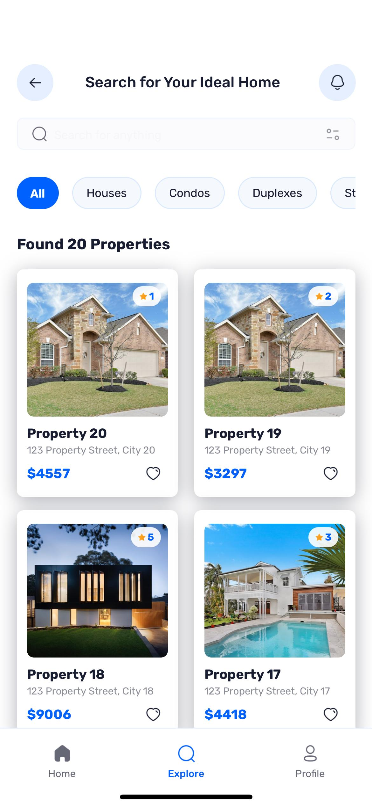
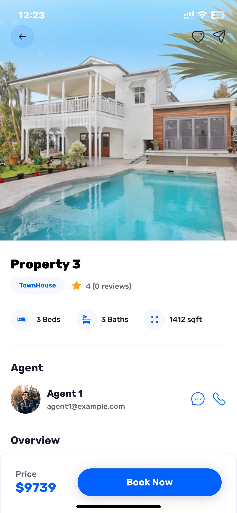
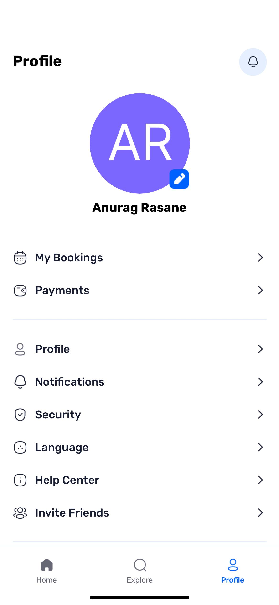

<div align="center">
  <br />
    <a href="https://github.com/rajrasane/RN_Real-Estate-App" target="_blank">
    </a>
  <br />
  <div>
    
    
    
    
  </div>

  <h3 align="center">ReState - A Real Estate App</h3>

   <div align="center">
     A modern React Native app for browsing and booking real estate properties with a clean UI, user authentication, and real-time data from Appwrite.
    </div>
</div>

## 📋 Table of Contents

1. [Introduction](#introduction)
2. [Tech Stack](#tech-stack)
3. [Features](#features)
4. [Screenshots](#screenshots)
5. [Quick Start](#quick-start)
6. [App Structure](#app-structure)
7. [Data Flow](#data-flow)
8. [Components](#components)
9. [Future Enhancements](#future-enhancements)
10. [Author](#author)

## <a name="introduction">🤖 Introduction</a>

ReState is a full-stack Real Estate application built with React Native, featuring Google authentication, dynamic property listings, and user profiles. The app is designed with modern tools like Expo, Appwrite, Tailwind CSS, and TypeScript for a seamless and scalable user experience.

The app allows users to browse properties, filter by type, view detailed information including images and amenities, and connect with agents. With time-based greetings and consistent UI elements across screens, ReState provides an intuitive and personalized experience.

## <a name="tech-stack">⚙️ Tech Stack</a>

- **Framework**: [React Native](https://reactnative.dev/) with [Expo](https://expo.dev/)
- **Routing**: [Expo Router](https://docs.expo.dev/router/introduction/)
- **Backend**: [Appwrite](https://appwrite.io/) for authentication, database, and storage
- **Styling**: [NativeWind](https://www.nativewind.dev/) (Tailwind CSS for React Native)
- **Fonts**: Custom Rubik font family for consistent typography
- **Language**: TypeScript for type safety and better developer experience

## <a name="features">🔋 Features</a>

✅ **Authentication with Google**: Secure and seamless user sign-ins using Google's authentication service.

✅ **Home Page**: Displays featured properties and recommendations with a clean, modern UI.

✅ **Explore Page**: Allows users to browse all types of properties with powerful search and filter functionality.

✅ **Property Details**: Comprehensive information about individual properties, including images, amenities, agent contact, and location details.

✅ **Profile Page**: User profile management with booking history and settings.

✅ **Time-based Greetings**: Personalized greeting based on user's local time (Morning/Afternoon/Evening).

✅ **Search & Filters**: Find properties based on type, location, and other criteria.

✅ **Responsive Design**: Works across different device sizes and orientations.

✅ **Custom Data Fetching**: Efficient API calls with custom hooks for optimal performance.

## <a name="screenshots">📷 Screenshots</a>

<div align="center">
  <table>
    <tr>
      <td></td>
      <td></td>
      <td></td>
      <td></td>
      <td></td>
    </tr>
  </table>
</div>

## <a name="quick-start">🚀 Quick Start</a>

### Prerequisites

- Node.js (v14 or later)
- Expo CLI
- Appwrite account and project setup

### Environment Variables

Create a `.env.local` file in the root directory with the following:

```env
EXPO_PUBLIC_APPWRITE_PROJECT_ID=your_project_id
EXPO_PUBLIC_APPWRITE_ENDPOINT=https://cloud.appwrite.io/v1
EXPO_PUBLIC_APPWRITE_DATABASE_ID=your_database_id
EXPO_PUBLIC_APPWRITE_AGENTS_COLLECTION_ID=your_agents_collection_id
EXPO_PUBLIC_APPWRITE_GALLERIES_COLLECTION_ID=your_galleries_collection_id
EXPO_PUBLIC_APPWRITE_REVIEWS_COLLECTION_ID=your_reviews_collection_id
EXPO_PUBLIC_APPWRITE_PROPERTIES_COLLECTION_ID=your_properties_collection_id
```

### Installation

1. Clone the repository:
   ```bash
   git clone https://github.com/rajrasane/RN_Real-Estate-App.git
   cd RN_Real-Estate-App
   ```

2. Install dependencies:
   ```bash
   npm install
   ```

3. Start the development server:
   ```bash
   npx expo start
   ```

In the output, you'll find options to open the app in a:
- Development build
- Android emulator
- iOS simulator
- Expo Go


## <a name="data-flow">🔄 Data Flow</a>

1. **Authentication**: Users sign in with Google OAuth via Appwrite
2. **Data Fetching**: Properties and user data are fetched from Appwrite database
3. **State Management**: Global context provides user state throughout the app
4. **Navigation**: Expo Router handles navigation between screens
5. **UI Rendering**: Components display data with NativeWind styling

## <a name="components">🧩 Key Components</a>

- **Cards**: Property card components for different display formats
- **Filters**: Property type filtering component
- **Search**: Search functionality for finding properties
- **NoResults**: Empty state component when no results are found

## <a name="future-enhancements">🔮 Future Enhancements</a>

- Dark mode support
- Property bookmarking
- In-app messaging with agents
- Property reviews and ratings
- Push notifications
- Virtual property tours

## <a name="author">👨‍💻 Author</a>

Raj Rasane - [rajrasane](https://github.com/rajrasane)

---

<div align="center">
  Made with ❤️ using React Native and Appwrite
</div>
